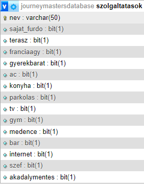
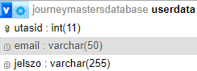
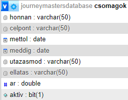
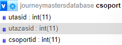
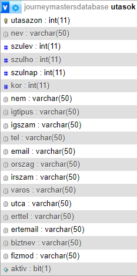
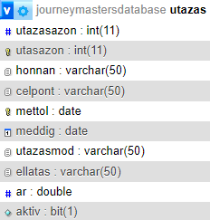
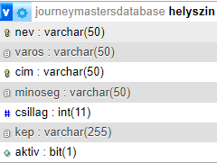

# Projekt 2.rész: Terv
## Adatbázis:
A tervezési fázisban az adatbázis szerkezetét gondoltuk újra.
Külön táblákat hoztunk létre: 
-	A szálláson megtalálható szolgáltatásoknak:
 
 
 
-	A felhasználói információknak:

 
-	Az előre létrehozott utazáscsomagoknak:
 
 
 
-	A csoportoknak, hogy egy utazáshoz több embert is lehessen társítani:

 
Ezek megvalósításához változtattunk az eddig meglévő táblákon is:
-	utasok:
 
   

-	utazas: 

 
-	helyszin: 

 

Továbbá, ahol szükséges, hozzáadtunk egy „aktiv” oszlopot, hogyha egy rekordra már nincs szükségünk ne kelljen törölni, csak inaktívvá tenni, így, ha később újra szükségünk van rá, nem kell újra létrehozni. 
 
Adatbázis kapcsolati terve:
 
 
## Funkcionalitás terv:
    1.	Regisztráció/belépés
        a.	nem kell minden utazásnál megadni minden adatot
    2.	Ajánlott utazások foglalása
        a.	előre létrehozott utazások
        b.	részletek
        c.	ellátási forma választása
        d.	utasadatok megadása
        e.	foglalás
    3.	Utazás tervezése és foglalása
        a.	időpont kiválasztása
        b.	helyszín kiválasztása
        c.	utazási mód kiválasztása
        d.	szállás kiválasztása
        e.	ellátási mód kiválasztása
        f.	utasadatok megadása
        g.	foglalás
    4.	Saját profil
        a.	profiladatok megjelenítése
        b.	korábbi és aktuális utazások megjelenítése
        c.	utazás lemondása
    5.	Kosár
        a.	foglalás áttekintése
        b.	foglalás véglegesítése
 
## Vizuális és szerkezeti terv:
    1.	Főoldal
        a.	bemutatkozás
        b.	ajánlott utazások
        c.	tervezés
        d.	about (statisztika, promóció)
    2.	Tervező oldal
        a.	időpont kiválasztása
        b.	helyszín kiválasztása
        c.	utazási mód kiválasztása
        d.	szállás kiválasztása
        e.	ellátási mód kiválasztása
        f.	adatok megadása
        g.	ajánlott szállások
        h.	foglalás
    3.	Előre szervezett utazások
        a.	ellátási mód kiválasztása
        b.	adatok megadása
        c.	foglalás
    4.	Profil oldal
        a.	profilhoz tartozó utazások
        b.	utazás lemondása
## Színvilág: 
-	világoskék(#08b4e4)
-	sötétkék(#1c4484)
-	zöld(#45ac0d)
-	sárga(#ffd700)
